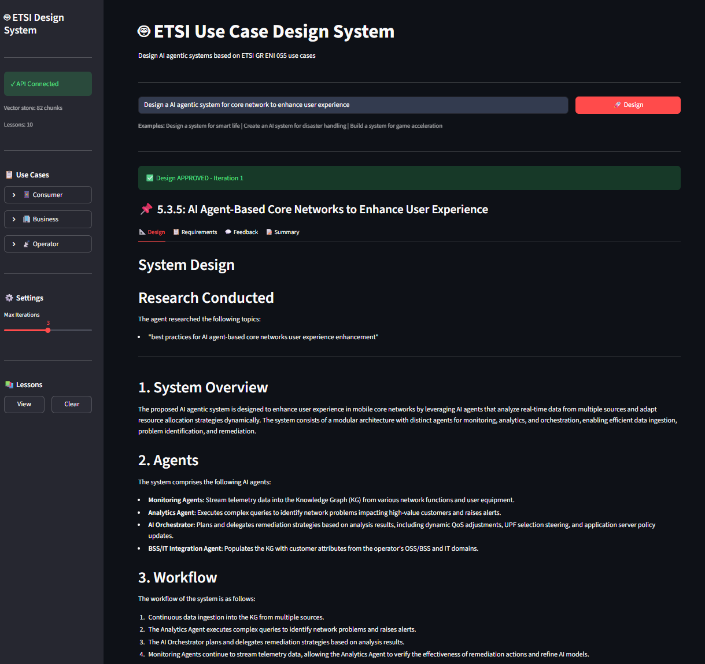

# Langgraph 1st project

A learning project exploring modern AI/LLM patterns through a practical application: designing AI agentic systems based on an PDF telco use cases study document

## 🎯 Learning Objectives

This project demonstrates the following AI/LLM concepts:

| Concept | Description | Implementation |
|---------|-------------|----------------|
| **Metadata-Filtered RAG** | Retrieval with structured filters | Filter by `use_case_id`, `section_type`, `category` |
| **Agentic RAG** | LLM decides how/what to retrieve | Query Agent reasons about which use case to search |
| **ReAct Agent** | Thought → Action → Observation loop | Design Agent with web research tool |
| **Tool** | Standardized tool integration | Brave Search integration for web research |
| **Multi-Agent System** | Multiple specialized agents | Query → Design → Feedback pipeline |
| **LLM-as-a-Judge** | LLM evaluates outputs | Feedback Agent evaluates designs against requirements |
| **Short-term Memory** | State within a workflow | Design state passed between agents |
| **Long-term Memory** | Persistent cross-session storage | Learned design lessons saved to JSON/DB |
| **Feedback Loop** | Iterative refinement | Design ↔ Feedback loop (max 3 iterations) |

---

## 🏗️ Architecture
```
┌─────────────────────────────────────────────────────────────────────────────┐
│                           SYSTEM ARCHITECTURE                               │
└─────────────────────────────────────────────────────────────────────────────┘

                              User Query
                                  │
                                  ▼
┌─────────────────────────────────────────────────────────────────────────────┐
│  AGENT 1: Query Analysis Agent (Ollama - llama3.1)                          │
│  ──────────────────────────────────────────────────                         │
│  • Agentic RAG: Reasons about query to identify use case                    │
│  • Calls vector store with correct use_case_id filter                       │
│  • Summarizes use case description                                          │
│  Output: use_case_id, use_case_name, description_summary                    │
└─────────────────────────────────────────────────────────────────────────────┘
                                  │
                                  ▼
┌─────────────────────────────────────────────────────────────────────────────┐
│  AGENT 2: Design Agent (Groq - llama-3.3-70b)                               │
│  ────────────────────────────────────────────                               │
│  • ReAct Pattern: Thinks, then decides to use tools                         │
│  • Tool: Web research for latest 3GPP/ETSI specs                        │
│  • Retrieves requirements from vector store                                 │
│  • Uses long-term memory (learned lessons)                                  │
│  Output: system_design                                                      │
│                                                                             │
│         ▲                                                                   │
│         │ Feedback Loop (max 3 iterations)                                  │
│         │                                                                   │
└─────────┼───────────────────────────────────────────────────────────────────┘
          │
          ▼
┌─────────────────────────────────────────────────────────────────────────────┐
│  AGENT 3: Feedback Agent (Groq - llama-3.3-70b)                             │
│  ─────────────────────────────────────────────                              │
│  • LLM-as-a-Judge: Evaluates design against requirements                    │
│  • Provides structured feedback with scores                                 │
│  • Updates long-term memory with learned lessons                            │
│  Output: is_approved, feedback, learned_lessons                             │
└─────────────────────────────────────────────────────────────────────────────┘
                                  │
                                  ▼
                           Final Design
```

---

## 📁 Project Structure
```
my_uc_analyzer/
├── data/
│   ├── ETSI_AI-Agent_core_usecases.pdf    # Source document
│   ├── chroma_db/                          # Vector store
│   └── lessons.json                        # Long-term memory
├── src/
│   ├── data_models.py                      # Pydantic models
│   ├── etsi_parser.py                      # PDF parsing with Docling
│   ├── vector_store.py                     # Chroma + metadata filtering
│   ├── agents/
│   │   ├── state.py                        # LangGraph state (short-term memory)
│   │   ├── memory.py                       # Long-term memory (JSON)
│   │   ├── memory_db.py                    # Long-term memory (SQLite)
│   │   ├── query_agent.py                  # Use case identification
│   │   ├── design_agent_react.py           # ReAct + MCP design agent
│   │   ├── feedback_agent.py               # LLM-as-a-Judge
│   │   ├── mcp_tools.py                    # Web search tool
│   │   └── graph.py                        # LangGraph workflow
│   ├── api/
│   │   ├── main.py                         # FastAPI app
│   │   ├── models.py                       # API Pydantic models
│   │   └── routes.py                       # API endpoints
│   └── web/
│       └── app.py                          # Streamlit UI
├── main.py                                 # CLI interface
├── pyproject.toml                          # Dependencies
└── README.md
```

---

## 🔧 Tech Stack

| Component | Technology |
|-----------|------------|
| **PDF Parsing** | Docling with HybridChunker |
| **Embeddings** | BAAI/bge-large-en-v1.5 (local, GPU) |
| **Vector Store** | ChromaDB |
| **LLM (Local)** | Ollama (llama3.1) |
| **LLM (Cloud)** | Groq (llama-3.3-70b-versatile) |
| **Agent Framework** | LangGraph |
| **Web Search** | Brave Search API |
| **Backend API** | FastAPI |
| **Frontend UI** | Streamlit |
| **Package Manager** | uv |

---

## 🚀 Quick Start

### Prerequisites

- Python 3.11+
- Ollama with llama3.1 model
- Groq API key
- Brave Search API key

### Installation
```bash
# Clone and enter project
cd my_uc_analyzer

# Install dependencies
uv sync

# Set up environment variables
cp .env.example .env
# GROQ_API_KEY=
# BRAVE_API_KEY=
# LANGSMITH_API_KEY=
# LANGSMITH_TRACING=
# LANGSMITH_PROJECT=
```

### Run CLI
```bash
uv run python main.py
```

### Run Web Interface
```bash
# Terminal 1: Start API
uv run uvicorn src.api.main:app --reload --port 8000

# Terminal 2: Start Streamlit
uv run streamlit run src/web/app.py --server.port 8501
```

Open http://localhost:8501

---

# Test Query Agent
uv run python src/agents/query_agent.py

# Test Design Agent
uv run python src/agents/design_agent_react.py

# Test Feedback Agent
uv run python src/agents/feedback_agent.py

# Test Full Graph
uv run python src/agents/graph.py

# Test streamlit ui
```
uv run uvicorn src.api.main:app --reload --port 8000
uv run streamlit run src/web/app.py --server.port 8501
```

